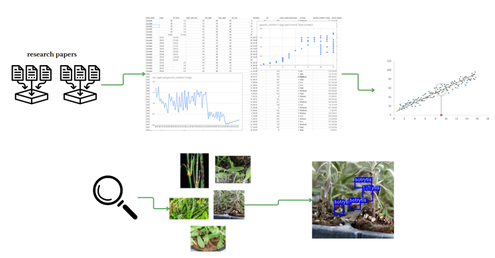

# IGREEN

## 🌿 Medical Plant Growth Optimization

IGREEN is a smart system designed to enhance the growth of medical plants in controlled hydroponic environments. It leverages advanced analysis of plant and environmental data to recommend optimal growth conditions tailored for each plant type.

The project was developed from scratch, beginning with extensive data collection from scientific research papers, public datasets, and manual logging. This raw data was processed, cleaned, and expanded using synthetic data generation techniques to ensure robustness and diversity.

By learning from both real and generated data, IGREEN adapts to different scenarios and environments. The system includes intelligent models that simulate plant responses, predict outcomes, and refine recommendations over time — making it ideal for precision agriculture.

It also features automated disease detection using image-based insights, a cloud-deployed backend for real-time updates, and a dynamic dashboard for users to monitor and manage their plant units. While it includes IoT hardware for sensing and control, the project’s core strength lies in turning raw data into actionable decisions for sustainable and high-quality plant production.

## 📂 Project Structure

The project is organized into multiple modules — each responsible for a core part of the pipeline. The structure below gives a high-level view of the components, while the following sections explain each part in detail.

```bash
IGREEN/
├── database/                     # Database design and storage logic
├── data_collection/             # Scripts and datasets used to collect and process raw data
│   ├── raw_data/                # Raw datasets from research papers or manual logging
│   └── processed_data/          # Cleaned and structured data used in modeling
├── prediction_model/            # Machine learning model for predicting optimal growth conditions
├── optimization_model/          # Optimization algorithms for plant growth conditions
│   ├── optimization/            # Genetic Algorithm (GA)-based experiments
│   └── RL/                      # Reinforcement Learning-based dynamic optimization
├── disease_detection/           # Vision-based plant disease detection
│   ├── dataset/                 # YOLO-compatible datasets (train/valid/test)
│   ├── runs/                    # Model training results and weights
│   └── predictions/             # Output images from YOLO predictions
├── deployment_aws/              # AWS Lambda, cloud functions, and integration scripts
├── models/                      # Saved models and serialized objects
```

## Table of Contents

- [🌿 Medical Plant Growth Optimization](#-medical-plant-growth-optimization)
- [📂 Project Structure](#-project-structure)
- [📊 Data Collection](#-data-collection)
- [Data Processing and Workflow](#data-processing-and-workflow)
  - [Data Understanding](#data-understanding)
  - [Data Processing](#data-processing)
  - [Synthetic Data Generation](#synthetic-data-generation)
  - [Prediction Model (KNN)](#prediction-model)
  - [Cloud Deployment](#deployment-and-cloud-integration)
  - [Dashboard](#data-analysis-and-dashboard)

## 📊 Data Collection



The project started with building a foundational dataset from scratch. Data was collected from various scientific research papers, open-source datasets, and experimental logs. The focus was on compiling environmental and plant-specific parameters relevant to medicinal plant growth.

The data was primarily related to:

- **Environmental conditions**: Temperature, humidity, pH, EC, light duration, etc.
- **Plant metadata**: Plant type, growth stage, and health status.
- **Growth outcomes**: Leaf count, height, biomass, and flowering indicators.

After collection, the data was structured into two major parts:

- [raw_data/](./data_collection/raw_data): Contains original logs and tables from research papers and experiments.
- [processed_data/](./data_collection/processed_data): Cleaned and transformed and synthetic generated datasets, ready for modeling and analysis. Preprocessing included:
  - Handling missing or inconsistent values
  - Normalization and encoding of categorical variables
  - Feature selection and statistical analysis

This structured dataset serves as the foundation for prediction, optimization, and recommendation models.

## Data processing and workflow

## 1.Workflow

### Data Understanding


Before data processing, it's important to explore and understand the dataset. This step involves:

1. Dataset Overview:
   The dataset includes key environmental factors affecting plant growth:
   * Temperature (min and max).
   * Humidity (min and max).
   * pH Levels (soil chemical balance).
   * Light Intensity (duration and intensity).
2. Initial Exploration:

* Identifying missing or incomplete values.
* Reviewing basic statistics (mean, median, range, etc.).
* Understanding the structure and distribution of data.

1. Visual Insights:

* Distribution of values for key features (e.g., temperature, humidity).
* Correlation between numerical features.
* Comparisons of key metrics (e.g., average water frequency per plant type).
  

### Data Processing

[data_processing/](./prediction_model/recommendation_work_GANs.ipynb)

This section outlines the processing steps applied to both the original dataset and the synthetic dataset to prepare them for analysis and model training. The goal was to clean, standardize, and adjust the data to ensure consistency and reliability for further processing.

#### 1. Original Data Processing

1. Plant Name Standardization:
   * Identified inconsistent plant names, such as Aleo Vera and Aloe Vera.
   * Replace all occurrences of Aleo Vera with the correct name, Aloe Vera.
   * Reason: Ensures uniformity in plant identification across the dataset, avoiding duplication and inconsistencies in analysis.


2. Temperature (temp):

   * Extracted minimum and maximum temperature values from ranges.
   * Replaced single absolute values with identical minimum and maximum values.
   * Reason: Standardized the format to ensure comparability across all entries.
3. Electrical Conductivity (EC ds/m):

   * Split ranges into EC_min and EC_max columns.
   * Replaced missing or invalid values with default values:
   * Minimum: Capped at 0.8.
   * Maximum: Limited to 2.0.
   * Reason: Ensures valid and realistic values for EC, critical for plant health.
4. pH (ph):

   * Converted ranges into ph_min and ph_max columns.
   * Adjusted values to fall within valid limits (e.g., ensuring ph_min is non-negative).
   * Reason: Ensures consistency and avoids errors from invalid pH values.
5. Humidity (humidity):

   * Extracted ranges into humidity_min and humidity_max columns.
   * Converted single values to equal minimum and maximum.
   * Reason: Ensures uniformity and accurate representation of environmental conditions.
6. Light Time (light_time_day):

   * Calculated the average for ranges and standardized single values.
     Reason: Facilitates direct comparison across records.


7. Watering Frequency (water_times (times/day)):

   * Verified and capped values:
   * Adjusted high values for specific plants (e.g., Aloe Vera) to realistic thresholds (e.g., maximum of 5).
   * Reason: Prevents skewing due to unrealistic watering frequencies.
8. Life Cycle (life cycle (m)):

   * Capped extreme values:
   * Maximum: 9 months.
   * Minimum: 1.5 months.
   * Reason: Aligns with realistic growth cycles for the plants in the dataset.
9. Growth Yield (growth_yield/m^2 (kg)):

   * Adjusted values outside the range of 1.0 to 5.5 using the mean for each plant.
   * Reason: Maintains realistic yield values and minimizes distortion.

### Synthetic data generation

[generating_syn_data/](./prediction_model/recommendation_work_GANs.ipynb)

The synthetic data generation process leverages a Conditional Generative Adversarial Network (ctGAN), a powerful deep learning technique, to augment the dataset with synthetic plant growth data. This method generates new, realistic data points that mimic the patterns and distributions present in the original dataset while preserving important correlations and relationships among features.

#### Using and Output of ctGAN:

* Data Preprocessing:

  * Categorical Features: Columns like plant_name, air_flow, plant_size, and watering_times were identified as categorical and treated appropriately.
  * Feature Engineering: Unnecessary columns (temp, EC ds/m, humidity, ph) were dropped, as they were not needed for synthetic data generation.
* ctGAN Model Training:

  * The ctGAN model was trained on the preprocessed dataset to learn the feature distributions and relationships.
  * Configuration:
  * Epochs: 3000 epochs were set for thorough training.
  * Batch Size: 100 for efficient processing.
  * Embedding Dimension: 800 to capture complex patterns and relationships between features.
* Synthetic Data Generation:

  * After training, the model generated 200 synthetic data samples, which reflect the distribution and correlations of the original data.
  * These samples were then stored for further analysis and use in model training.

#### Synthetic Data Adjustments

1. Consistency with Original Data:

   * Ensured that synthetic data values aligned with ranges and distributions in the original dataset (e.g., light intensity, watering frequency).
2. Validation Adjustments:

   * Adjusted synthetic data for columns such as red_light, far_red, and others:
   * Replaced outliers or unrealistic values with means from the original data.
   * Capped values to defined limits (e.g., red_light minimum of 40 and maximum of 80).
3. Integration:

   * Merged synthetic and original data to create a comprehensive dataset.
   * Validated distributions to ensure synthetic data did not introduce biases.


### Prediction model

In this section, we will explore how to build a plant prediction model using the K-Nearest Neighbors (KNN) algorithm, based on various environmental factors that influence plant growth. The process begins with data preparation, where we handle categorical features like "plant size" and "air flow" by applying One-Hot Encoding to make them suitable for machine learning algorithms.

After preparing the data, the model is trained using both real data and synthetic data generated through techniques like CTGAN. The model’s performance is then evaluated by assessing its prediction accuracy. We also incorporate statistical significance testing using methods such as the Paired t-test and Wilcoxon signed-rank test to understand the reliability of the results.

#### Using KNN in the Project

##### Data Preprocessing:

Before applying KNN, we preprocess the data by converting categorical features like "plant size" and "air flow" into numerical values using one-hot encoding. The data is also standardized to ensure that all features contribute equally to the distance calculation in the KNN model.

##### Distance Calculation:

KNN calculates the distance between the input data and the training data using Euclidean distance. This helps identify the closest neighbors based on the environmental conditions of the plant.

##### Choosing the Number of Neighbors (k):

For the project, we select k=7k = 7, meaning the model looks at the 7 nearest neighbors to make its prediction. The optimal value of kk was chosen based on cross-validation to ensure the model's generalization.


### Deployment and Cloud Integration

The trained KNN model is saved as a .pkl file and deployed on the cloud for real-time use.
In the cloud, the data is processed through the deployed KNN model, which generates a prediction for the most suitable plant type. This output is then sent back to the application, where the user can view recommendations and make informed decisions.


### **Data analysis and dashboard**

A custom monitoring dashboard was developed using **Grafana**, connected to a cloud-hosted database. It provides two key interfaces:

- **Real-Time Dashboard**: Displays live sensor readings and actuator statuses.
- **Historical Dashboard**: Offers long-term trends and analysis to support data-driven decisions.

---

### 🟢 Real-Time Dashboard

This dashboard visualizes the current state of the system, allowing immediate feedback and monitoring.


#### ✅ Sensor Readings

- **Airflow Level**: Ensures proper air circulation.
- **Solution Level**: Tracks nutrient levels to prevent shortages.
- **Light Intensity**: Monitors far-red, red, blue, and overall light levels.
- **CO₂ Levels**: Maintains optimal photosynthesis conditions.
- **Temperature & Humidity**: Keeps ambient conditions within required thresholds.

> Visualization: Gauges and numeric indicators for clarity.

#### ⚙️ Actuator States

- **Water Pump**: On/Off status.
- **Fans**: Operational status.
- **Heater**: Activity monitoring.

> Visualization: Status indicators and last activation timestamps.

---

### 📈 Historical Dashboard

Used for analyzing long-term performance and trends.


#### 🔁 Features:

- **Time-Series Sensor Data**: Temperature, humidity, pH, EC, etc.
- **Disease Detection Log**: Records of identified diseases by time and plant.
- **Yield & Quality Metrics**: Tracks plant weight and active compounds.
- **Sensor & Plate History**: Full traceability by plant and plate IDs.

> Visualization: Line charts, bar charts, and interactive tables.

---

## **Disease detection** [disease detection](./disease_detection/)

**The Disease Detection Model is designed to identify two common diseases affecting lavender plants: Septoria and Botrytis.**

[try the model ](https://demo.roboflow.com/lavender-disease/1?publishable_key=rf_O6LkWn3op3SQWLKIoWwroSbjeW22)


## Data Collection

### Image Dataset

* Source: Images were collected from online repositories, research databases, and field observations.

### Image Preprocessing

* Steps Taken:
  * Resizing images to a uniform resolution to ensure consistency.
  * Enhancing image quality using techniques like histogram equalization.
  * Augmenting data to increase variability:
    * Rotation, flipping, and cropping.
    * Adjusting brightness, contrast, and saturation.

### Annotation

* Tool Used: LabelImg
* Process:
  * Images were annotated manually to label infected and healthy regions.
  * Disease-specific labels: Septoria and Botrytis.
  * Bounding boxes were drawn around visible symptoms such as lesions, discoloration, and fungal growth.


#### Results

* Accuracy: 92.5%
* Precision: 91.8% (Septoria), 93.2% (Botrytis)
* Recall: 89.5% (Septoria), 94.1% (Botrytis)
* F1-Score: 90.6% (Septoria), 93.6% (Botrytis)

---

## **Plant Optimization** [optimization](./optimization_model/optimization/)

**The optimization of plant growth conditions is essential for achieving the highest possible plant performance, especially in environments where precise control over variables like light, temperature, and water is necessary. In this project, we aim to optimize these conditions across different growth stages of plants—namely Germination, Vegetative, and Flowering—by using a mechanistic model in combination with genetic algorithms.**

### Approach

We used a **mechanistic model** to simulate plant behavior based on biological principles, combined with a **Genetic Algorithm (GA)** to find the best conditions. This method is especially useful when real-world data is limited.

### Optimization Goals

- **Maximize photosynthesis and biomass production**
- **Improve resource utilization** (light, water, temperature)
- **Ensure plant-specific, stage-specific environmental tuning**


#### Impact of Optimized Growth Conditions on Plant Yield

* Biomass at Each Stage:

  * Germination: 152.76 grams
  * Vegetative: 1,433.67 grams
  * Flowering: 1,493.80 grams

##### Ongoing Work: Reinforcement Learning for Dynamic Optimization [optimization with RL](./optimization_model/RL/)

While the current optimization approach uses a mechanistic model and Genetic Algorithm, we are actively extending the system by integrating **Reinforcement Learning (RL)** to enable **dynamic, real-time adjustment of environmental conditions**.

Using RL, the system will learn to adapt light, temperature, and water levels continuously based on plant responses and sensor feedback—allowing **autonomous, stage-aware environmental control** without manual intervention.
